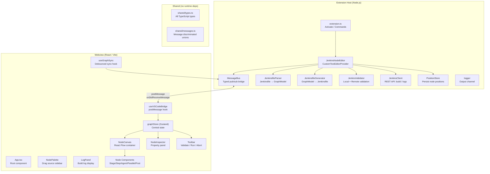
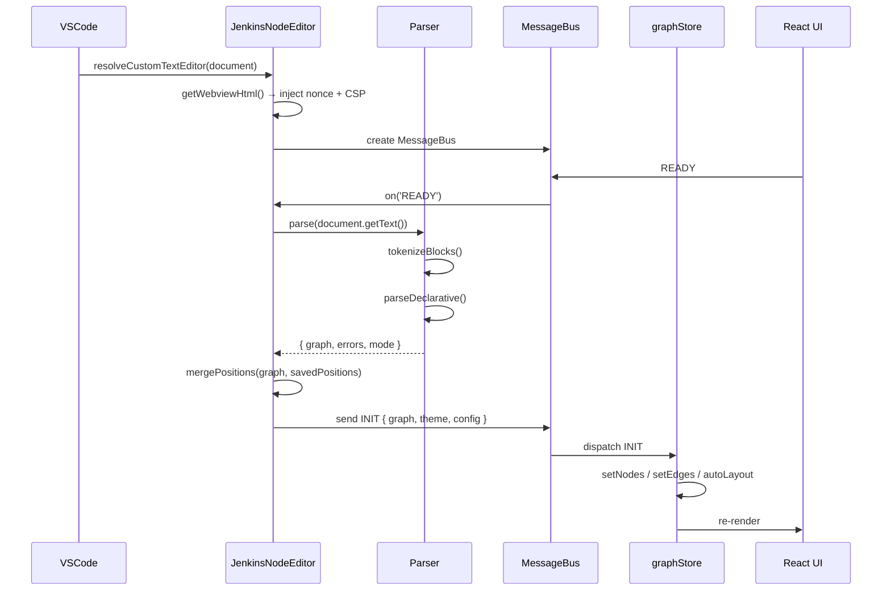
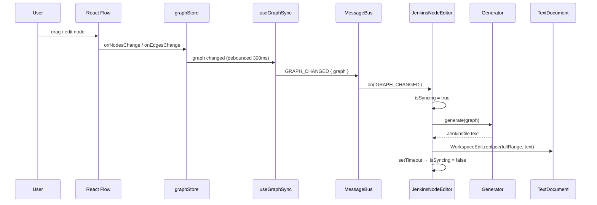
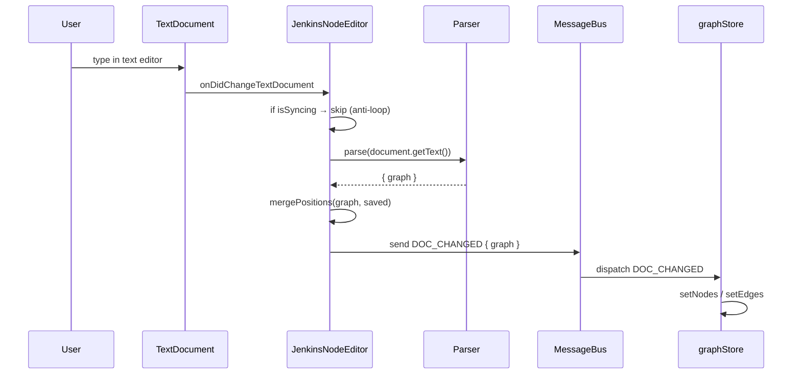
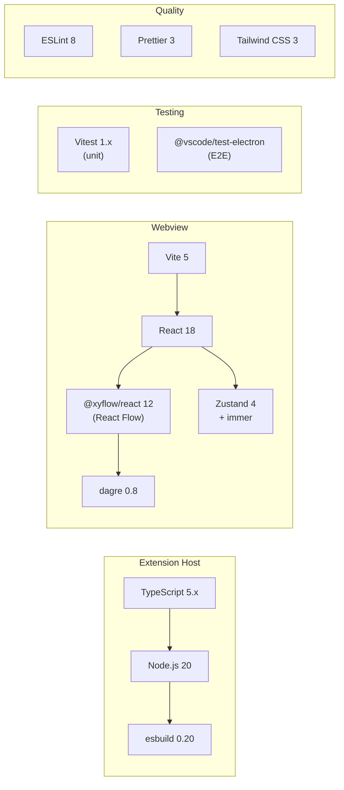

# Jenkins Node Editor

> **A VS Code extension that turns any `Jenkinsfile` into an interactive visual node graph — edit it, run builds, and stream logs, all without leaving your editor.**

<div align="center">


</div>

---

## Table of Contents

- [Overview](#overview)
- [Features](#features)
- [Architecture](#architecture)
- [Data Flow](#data-flow)
- [Node Types](#node-types)
- [Message Protocol](#message-protocol)
- [Project Structure](#project-structure)
- [Installation](#installation)
- [Configuration](#configuration)
- [Usage](#usage)
- [Development](#development)
- [Testing](#testing)
- [Tech Stack](#tech-stack)

---

## Overview

Jenkins Node Editor renders a `Jenkinsfile` as a **live, editable node graph** powered by [React Flow](https://reactflow.dev/). Changes made in the graph are immediately reflected in the source file, and changes made in the text editor instantly update the graph — a true **bidirectional sync**.

```
┌─────────────────────────────────────────────────────────────────┐
│                        VS Code Window                           │
│                                                                 │
│  ┌─────────────────────────┐   ┌───────────────────────────┐   │
│  │   Text Editor (classic) │◄──►  Jenkins Node Editor       │   │
│  │                         │   │  (Custom Editor Webview)   │   │
│  │  pipeline {             │   │                            │   │
│  │    agent any            │   │  ┌─────┐  ┌───────┐       │   │
│  │    stages {             │   │  │Agent│─►│ Build │       │   │
│  │      stage('Build') {   │   │  └─────┘  └───┬───┘       │   │
│  │        ...              │   │               │            │   │
│  │      }                  │   │           ┌───▼───┐        │   │
│  │    }                    │   │           │ Test  │        │   │
│  │  }                      │   │           └───┬───┘        │   │
│  │                         │   │               │            │   │
│  └─────────────────────────┘   │           ┌───▼───┐        │   │
│                                │           │Deploy │        │   │
│                                └───────────┴───────┴────────┘   │
└─────────────────────────────────────────────────────────────────┘
```

---

## Features

| Feature | Description |
|---------|-------------|
| **Visual Graph Editor** | Drag, drop, and connect pipeline nodes visually |
| **Bidirectional Sync** | Edit text → graph updates; edit graph → text updates |
| **Auto-layout** | Dagre-powered automatic node positioning on open |
| **Declarative Parser** | Full support for `pipeline {}`, `stages`, `agent`, `when`, `environment`, `parameters`, `triggers`, `post` |
| **Scripted Fallback** | Basic `node {}` scripted pipeline support |
| **Node Palette** | Drag new nodes from a sidebar palette |
| **Node Inspector** | Select any node to edit its properties in a side panel |
| **Validation** | Local syntax check + optional remote Jenkins API validation |
| **Build Trigger** | Trigger Jenkins builds directly from the editor |
| **Log Streaming** | Real-time build log streaming via progressive text API |
| **Theme Support** | Follows VS Code light / dark / high-contrast themes |
| **Position Memory** | Node positions are persisted in `.vscode/` between sessions |

---

## Architecture

The extension is split into two isolated runtimes that communicate via a typed message bus.



---

## Data Flow

### Opening a Jenkinsfile



### Editing the Graph → File Sync



### Text Edit → Graph Sync



---

## Node Types

The graph model uses 11 distinct node kinds, each rendered by a dedicated React component:


| Kind | Icon | Description | Key Data Fields |
|------|------|-------------|-----------------|
| `pipeline` | 🔵 | Root container node | `declarative: boolean` |
| `agent` | 🟢 | Execution agent declaration | `type`, `image`, `label`, `filename` |
| `stage` | 🟡 | Named pipeline stage | `name`, `when`, `agent`, `failFast` |
| `step` | ⚪ | Individual build step | `type`, `script`, `message`, `url`, … |
| `parallel` | 🟣 | Parallel execution group | `branches: string[]` |
| `post` | 🔴 | Post-build condition block | `condition` (always/failure/success/…) |
| `environment` | 🔶 | Environment variables block | `variables[]` |
| `options` | 🔷 | Pipeline options | timeout, disableConcurrentBuilds, … |
| `parameters` | 🟤 | Build parameters | `name`, `type`, `defaultValue` |
| `triggers` | ⬛ | Trigger definitions | cron, pollSCM |
| `when` | 🔲 | Conditional execution | `type`, `value`, `name` |

### Supported Step Types

| Step | DSL | Generated Output |
|------|-----|-----------------|
| `sh` | Shell command | `sh 'command'` |
| `echo` | Print message | `echo 'message'` |
| `git` | Git checkout | `git url: '…', branch: '…'` |
| `checkout` | SCM checkout | `checkout scm` |
| `archiveArtifacts` | Archive files | `archiveArtifacts artifacts: '**/*.jar'` |
| `junit` | Test results | `junit '**/surefire-reports/*.xml'` |
| `timeout` | Step timeout | `timeout(time: 10, unit: 'MINUTES')` |
| `retry` | Retry on fail | `retry(3)` |
| `custom` | Any other step | raw Groovy preserved |

### Supported Agent Types

| Type | Description | Example |
|------|-------------|---------|
| `any` | Any available agent | `agent any` |
| `none` | No global agent | `agent none` |
| `label` | Agent with label | `agent { label 'linux' }` |
| `docker` | Docker container | `agent { docker { image 'node:20' } }` |
| `dockerfile` | Build from Dockerfile | `agent { dockerfile { filename 'Dockerfile.ci' } }` |

---

## Message Protocol

Communication between the Extension Host and the Webview uses strongly-typed discriminated unions.

### Extension → Webview

```
┌──────────────────┬────────────────────────────────────────────────┐
│ Message Type     │ Payload                                        │
├──────────────────┼────────────────────────────────────────────────┤
│ INIT             │ { graph: GraphModel, theme, config }           │
│ DOC_CHANGED      │ { graph: GraphModel }                          │
│ VALIDATION_RESULT│ { errors: ValidationError[] }                  │
│ STEP_CATALOG     │ { steps: StepDefinition[] }                    │
│ LOG_LINE         │ { line: string, stream: 'stdout'│'stderr' }    │
│ BUILD_STATUS     │ { status: BuildStatus }                        │
│ THEME_CHANGED    │ { theme: VSCodeTheme }                         │
└──────────────────┴────────────────────────────────────────────────┘
```

### Webview → Extension

```
┌──────────────────┬────────────────────────────────────────────────┐
│ Message Type     │ Payload                                        │
├──────────────────┼────────────────────────────────────────────────┤
│ READY            │ (none) — webview mounted and ready             │
│ GRAPH_CHANGED    │ { graph: GraphModel }                          │
│ VALIDATE_REQUEST │ (none) — trigger validation                    │
│ RUN_BUILD        │ { jobName?, branch?, params? }                 │
│ ABORT_BUILD      │ (none) — stop running build                    │
│ ERROR            │ { message: string, stack? }                    │
└──────────────────┴────────────────────────────────────────────────┘
```

---

## Project Structure

```
NodeCi/
├── 📄 package.json                  # Extension manifest + scripts
├── 📄 tsconfig.json                 # Extension host TypeScript config
├── 📄 tsconfig.webview.json         # Webview TypeScript config
├── 📄 vite.config.ts                # Webview build (Vite)
├── 📄 esbuild.config.js             # Extension build (esbuild)
├── 📄 vitest.config.ts              # Unit test config
│
├── 📁 src/
│   ├── 📁 extension/               # Extension host (Node.js runtime)
│   │   ├── extension.ts            # Activate / deactivate + commands
│   │   ├── JenkinsNodeEditor.ts    # CustomTextEditorProvider (main)
│   │   ├── MessageBus.ts           # Typed pub/sub bridge
│   │   ├── JenkinsValidator.ts     # Local + REST validation
│   │   ├── JenkinsClient.ts        # Jenkins REST API client
│   │   ├── PositionStore.ts        # Persistent node positions
│   │   └── logger.ts               # VS Code output channel
│   │
│   ├── 📁 parser/                  # Jenkinsfile ↔ GraphModel
│   │   ├── JenkinsfileParser.ts    # Jenkinsfile → GraphModel
│   │   ├── JenkinsfileGenerator.ts # GraphModel → Jenkinsfile
│   │   ├── ASTTypes.ts             # AST type re-exports
│   │   └── layout.ts               # Dagre layout (extension-side)
│   │
│   ├── 📁 shared/                  # Zero-dependency shared types
│   │   ├── types.ts               # All domain types
│   │   └── messages.ts            # Message protocol types
│   │
│   └── 📁 webview/                 # React UI (browser runtime)
│       ├── main.tsx               # React entry point
│       ├── App.tsx                # Root component
│       ├── 📁 components/
│       │   ├── NodeCanvas.tsx     # React Flow canvas
│       │   ├── NodePalette.tsx    # Drag-source sidebar
│       │   ├── NodeInspector.tsx  # Property editor panel
│       │   ├── Toolbar.tsx        # Validate / Run / Abort bar
│       │   └── LogPanel.tsx       # Streaming log display
│       ├── 📁 nodes/
│       │   ├── BaseNode.tsx       # Shared node chrome
│       │   ├── StageNode.tsx      # Stage node component
│       │   ├── StepNode.tsx       # Step node component
│       │   ├── AgentNode.tsx      # Agent node component
│       │   ├── ParallelNode.tsx   # Parallel node component
│       │   ├── PostNode.tsx       # Post node component
│       │   └── index.ts           # nodeTypes map
│       ├── 📁 hooks/
│       │   ├── useVSCodeBridge.ts # VS Code postMessage hook
│       │   ├── useGraphSync.ts    # Debounced graph→ext sync
│       │   └── useJenkinsAPI.ts   # Validate / run / abort hooks
│       ├── 📁 store/
│       │   └── graphStore.ts      # Zustand + immer store
│       ├── 📁 utils/
│       │   ├── layout.ts          # Dagre layout (webview-side)
│       │   └── theme.ts           # VS Code theme → CSS vars
│       └── 📁 styles/
│           └── globals.css        # Global CSS + VS Code overrides
│
├── 📁 test/
│   ├── runTests.js                # E2E test runner
│   ├── 📁 fixtures/
│   │   ├── simple.Jenkinsfile     # 3-stage declarative pipeline
│   │   ├── parallel.Jenkinsfile   # Parallel stages example
│   │   └── complex.Jenkinsfile    # Full-featured pipeline
│   └── 📁 suite/
│       └── parser.test.ts        # 19 Vitest unit tests
│
├── 📁 docs/
│   ├── PHASE1.md                  # VS Code foundations
│   ├── PHASE2.md                  # React Flow engine
│   ├── PHASE3.md                  # Parser ↔ Generator
│   ├── PHASE4.md                  # Bidirectional sync
│   ├── PHASE5.md                  # Jenkins API integration
│   └── PHASE6.md                  # Packaging & publish
│
└── 📁 dist/                        # Build output (git-ignored)
    ├── extension.js               # Bundled extension host
    └── 📁 webview/
        ├── main.js               # Bundled React app
        └── main.css              # Bundled styles
```

---

## Installation

### From Source

**Prerequisites:** Node.js ≥ 20, npm ≥ 10, VS Code ≥ 1.85

```bash
# Clone the repository
git clone https://github.com/PlanesZwalker/vscode-jenkins-node-editor.git
cd vscode-jenkins-node-editor

# Install all dependencies
npm install

# Build both extension and webview
npm run build

# Launch in VS Code Extension Development Host (press F5)
# or install the .vsix:
npm run package
code --install-extension vscode-jenkins-node-editor-0.1.0.vsix
```

### From VS Code Marketplace

Search for **"Jenkins Node Editor"** in the Extensions panel (`Ctrl+Shift+X`).

---

## Configuration

Open VS Code Settings (`Ctrl+,`) and search for **Jenkins Node Editor**:

| Setting | Type | Default | Description |
|---------|------|---------|-------------|
| `jenkinsNodeEditor.jenkinsUrl` | string | `""` | Jenkins server URL, e.g. `http://localhost:8080` |
| `jenkinsNodeEditor.jenkinsUser` | string | `""` | Jenkins username for API auth |
| `jenkinsNodeEditor.jenkinsToken` | string | `""` | Jenkins API token (generate at `/me/configure`) |
| `jenkinsNodeEditor.autoLayout` | boolean | `true` | Auto-layout graph when opening a file |
| `jenkinsNodeEditor.syncDelay` | number | `300` | Debounce delay (ms) before syncing graph → text |

### Example `settings.json`

```json
{
  "jenkinsNodeEditor.jenkinsUrl": "http://jenkins.example.com:8080",
  "jenkinsNodeEditor.jenkinsUser": "alice",
  "jenkinsNodeEditor.jenkinsToken": "11abc123def456",
  "jenkinsNodeEditor.autoLayout": true,
  "jenkinsNodeEditor.syncDelay": 300
}
```

> **Security note:** The API token is stored in VS Code's settings file. For production use, consider storing sensitive values in VS Code's secret storage.

---

## Usage

### Opening the Node Editor

1. Open any file named `Jenkinsfile`, `*.jenkinsfile`, or `Jenkinsfile.*`
2. Click the **$(type-hierarchy) Jenkins Node Editor** icon in the editor title bar, **or** right-click → _Open With_ → _Jenkins Node Editor_
3. The graph panel opens beside the text editor

### Editing Nodes

| Action | How |
|--------|-----|
| **Select node** | Click any node |
| **Move node** | Drag the node header |
| **Edit properties** | Select node → Inspector panel (right side) |
| **Add node** | Drag from the Node Palette (left side) |
| **Delete node** | Select + `Delete` key |
| **Connect nodes** | Drag from a node's output handle to another's input |
| **Auto-layout** | Click the layout button in the Toolbar |
| **Zoom** | Scroll wheel / pinch gesture |
| **Pan** | Middle-click drag, or hold `Space` + drag |

### Validating & Running

```
Toolbar: [ Validate ] [ Run Build ] [ Abort ] [ Auto-layout ] [ Zoom Fit ]
```

- **Validate** — runs local syntax validation (always available) + remote Jenkins API validation (requires `jenkinsUrl` to be configured)
- **Run Build** — triggers a Jenkins build for the current pipeline
- **Abort** — stops the current running build
- Validation errors appear as red markers on the affected nodes and in the Problems panel

### Build Logs

When a build is running, the **Log Panel** slides up from the bottom of the webview and streams log lines in real-time using Jenkins' progressive text API.

---

## Development

### Build Scripts

```bash
npm run build         # Build everything (extension + webview)
npm run build:ext     # Build only the extension host via esbuild
npm run build:web     # Build only the webview via Vite
npm run watch         # Watch mode for both (use with F5)
npm run lint          # ESLint
npm run format        # Prettier
npm run test:unit     # Vitest unit tests
npm run test:e2e      # @vscode/test-electron E2E tests
npm run package       # Bundle as .vsix
npm run publish       # Publish to marketplace (requires vsce login)
```

### Debugging with F5

1. Open the workspace in VS Code
2. Press `F5` → launches **Extension Development Host**
3. In the new window, open a `Jenkinsfile`
4. Set breakpoints in `src/extension/` — they work directly in the Extension Host
5. For webview debugging: open _Developer Tools_ in the new window (`Ctrl+Shift+I`) and inspect the webview iframe

### Parser Development

The parser uses a **character-by-character block tokenizer** (`tokenizeBlocks`) — no external parser dependencies. It handles:

- Nested `{ }` blocks tracking brace depth
- String literals (`'`, `"`, `'''`, `"""`) — skip contents
- Line comments (`//`) and block comments (`/* */`)
- Partial/unbalanced input (EOF closes open blocks gracefully)

To test parser changes:

```bash
npm run test:unit -- --reporter=verbose
```

### Adding a New Node Type

1. Add the new `NodeKind` literal to `src/shared/types.ts`
2. Create `src/webview/nodes/MyNewNode.tsx` extending `BaseNode`
3. Register it in `src/webview/nodes/index.ts`
4. Add a palette entry in `src/webview/components/NodePalette.tsx`
5. Handle the kind in `JenkinsfileParser.ts` and `JenkinsfileGenerator.ts`

---

## Testing

### Unit Tests (Vitest)

19 tests covering the parser and generator:

```bash
npm run test:unit
```

```
✓ test/suite/parser.test.ts (19 tests)

  JenkinsfileParser — simple.Jenkinsfile
    ✓ parses without fatal errors
    ✓ detects declarative mode
    ✓ extracts 3 stage nodes (Build, Test, Deploy)
    ✓ stage names match Jenkinsfile
    ✓ extracts agent node (type: any)
    ✓ extracts post nodes
    ✓ all nodes have valid positions after layout
    ✓ edges connect stages in sequence

  JenkinsfileParser — parallel.Jenkinsfile
    ✓ parses without fatal errors
    ✓ detects parallel node
    ✓ parallel branches are present

  JenkinsfileParser — error cases
    ✓ empty string → error
    ✓ unbalanced braces → error
    ✓ partial input → partial graph

  JenkinsfileGenerator
    ✓ output contains 'pipeline' and 'stages'
    ✓ output ends with '}'
    ✓ indentation is divisible by 2
    ✓ round-trip preserves stage count
    ✓ generates agent block correctly

Test Files  1 passed (1)
     Tests  19 passed (19)
  Duration  ~500ms
```

### Test Fixtures

| Fixture | Description |
|---------|-------------|
| `simple.Jenkinsfile` | 3 stages (Build/Test/Deploy), `agent any`, post block |
| `parallel.Jenkinsfile` | Parallel stages, failFast |
| `complex.Jenkinsfile` | Environment vars, parameters, triggers, when conditions, Docker agent |

---

## Tech Stack



| Layer | Technology | Version | Role |
|-------|-----------|---------|------|
| Extension host | TypeScript | 5.x | Type-safe extension code |
| Extension build | esbuild | 0.20 | Fast CJS bundle for Node.js |
| Webview UI | React | 18 | Component-based UI |
| Webview build | Vite | 5 | Fast ESM webview bundle |
| Node graph | `@xyflow/react` | 12 | Interactive canvas |
| State | Zustand + immer | 4.x | Immutable reactive store |
| Layout | dagre | 0.8.5 | Directed-graph auto-layout |
| Styling | Tailwind CSS | 3.x | Utility-first CSS |
| Unit tests | Vitest | 1.x | Fast test runner |
| E2E tests | `@vscode/test-electron` | 2.x | Real VS Code instance |
| Lint | ESLint | 8 | Code quality |
| Format | Prettier | 3 | Code formatting |

---

## Contributing

1. Fork and clone the repository
2. Create a feature branch: `git checkout -b feat/my-feature`
3. Install dependencies: `npm install`
4. Make your changes and add tests
5. Ensure all tests pass: `npm test`
6. Ensure the build is clean: `npm run build`
7. Format your code: `npm run format`
8. Open a Pull Request

---

## License

Apache 2.0 © 2026 [PlanesZwalker](https://github.com/PlanesZwalker) — see [LICENSE](LICENSE) for details.
