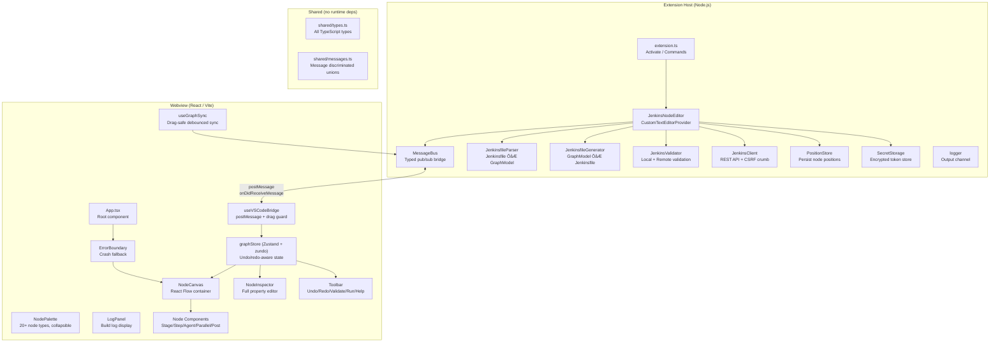
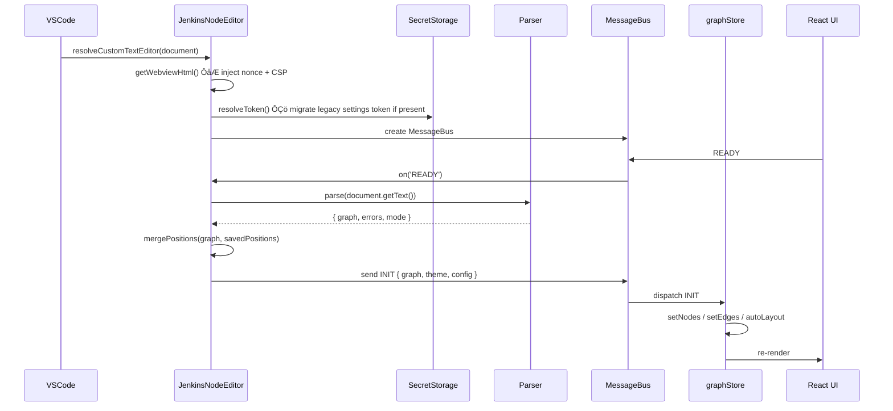
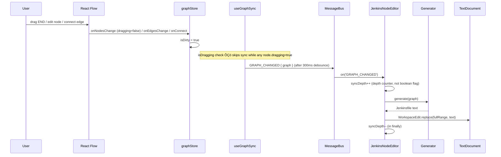
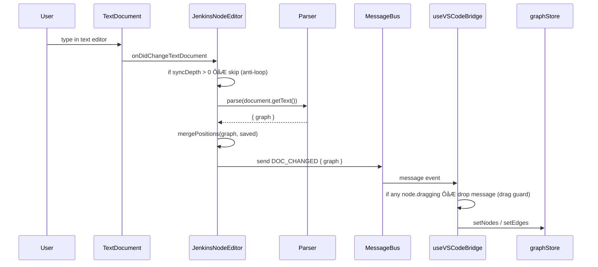
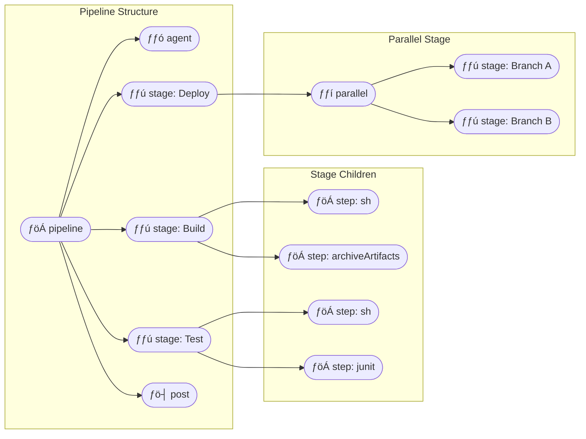

# Jenkins Node Editor

<div align="center">


> **A VS Code extension that turns any `Jenkinsfile` into an interactive visual node graph ÔÇö edit it, run builds, and stream logs, all without leaving your editor.**


</div>

---

## Table of Contents

- [Overview](#overview)
- [Features](#features)
- [Architecture](#architecture)
- [Data Flow](#data-flow)
- [Node Types](#node-types)
- [Message Protocol](#message-protocol)
- [Project Structure](#project-structure)
- [Installation](#installation)
- [Configuration](#configuration)
- [Usage](#usage)
- [Security](#security)
- [Development](#development)
- [Testing](#testing)
- [Tech Stack](#tech-stack)
- [Contributing](#contributing)
- [License](#license)

---

## Overview

Jenkins Node Editor renders a `Jenkinsfile` as a **live, editable node graph** powered by [React Flow](https://reactflow.dev/). Changes made in the graph are immediately reflected in the source file, and changes made in the text editor instantly update the graph ÔÇö a true **bidirectional sync**.

The UI is styled after **Blue Ocean**, Jenkins' own modern pipeline visualization UI.

```
ÔöîÔöÇÔöÇÔöÇÔöÇÔöÇÔöÇÔöÇÔöÇÔöÇÔöÇÔöÇÔöÇÔöÇÔöÇÔöÇÔöÇÔöÇÔöÇÔöÇÔöÇÔöÇÔöÇÔöÇÔöÇÔöÇÔöÇÔöÇÔöÇÔöÇÔöÇÔöÇÔöÇÔöÇÔöÇÔöÇÔöÇÔöÇÔöÇÔöÇÔöÇÔöÇÔöÇÔöÇÔöÇÔöÇÔöÇÔöÇÔöÇÔöÇÔöÇÔöÇÔöÇÔöÇÔöÇÔöÇÔöÇÔöÇÔöÇÔöÇÔöÇÔöÇÔöÇÔöÇÔöÇÔöÇÔöÉ
Ôöé                        VS Code Window                           Ôöé
Ôöé                                                                 Ôöé
Ôöé  ÔöîÔöÇÔöÇÔöÇÔöÇÔöÇÔöÇÔöÇÔöÇÔöÇÔöÇÔöÇÔöÇÔöÇÔöÇÔöÇÔöÇÔöÇÔöÇÔöÇÔöÇÔöÇÔöÇÔöÇÔöÇÔöÇÔöÉ   ÔöîÔöÇÔöÇÔöÇÔöÇÔöÇÔöÇÔöÇÔöÇÔöÇÔöÇÔöÇÔöÇÔöÇÔöÇÔöÇÔöÇÔöÇÔöÇÔöÇÔöÇÔöÇÔöÇÔöÇÔöÇÔöÇÔöÇÔöÇÔöÉ   Ôöé
Ôöé  Ôöé   Text Editor (classic) ÔöéÔùäÔöÇÔöÇÔû║  Jenkins Node Editor       Ôöé   Ôöé
Ôöé  Ôöé                         Ôöé   Ôöé  (Custom Editor Webview)   Ôöé   Ôöé
Ôöé  Ôöé  pipeline {             Ôöé   Ôöé                            Ôöé   Ôöé
Ôöé  Ôöé    agent any            Ôöé   Ôöé  ÔöîÔöÇÔöÇÔöÇÔöÇÔöÇÔöÉ  ÔöîÔöÇÔöÇÔöÇÔöÇÔöÇÔöÇÔöÇÔöÉ       Ôöé   Ôöé
Ôöé  Ôöé    stages {             Ôöé   Ôöé  ÔöéAgentÔöéÔöÇÔû║Ôöé Build Ôöé       Ôöé   Ôöé
Ôöé  Ôöé      stage('Build') {   Ôöé   Ôöé  ÔööÔöÇÔöÇÔöÇÔöÇÔöÇÔöÿ  ÔööÔöÇÔöÇÔöÇÔö¼ÔöÇÔöÇÔöÇÔöÿ       Ôöé   Ôöé
Ôöé  Ôöé        ...              Ôöé   Ôöé               Ôöé            Ôöé   Ôöé
Ôöé  Ôöé      }                  Ôöé   Ôöé           ÔöîÔöÇÔöÇÔöÇÔû╝ÔöÇÔöÇÔöÇÔöÉ        Ôöé   Ôöé
Ôöé  Ôöé    }                    Ôöé   Ôöé           Ôöé Test  Ôöé        Ôöé   Ôöé
Ôöé  Ôöé  }                      Ôöé   Ôöé           ÔööÔöÇÔöÇÔöÇÔö¼ÔöÇÔöÇÔöÇÔöÿ        Ôöé   Ôöé
Ôöé  Ôöé                         Ôöé   Ôöé               Ôöé            Ôöé   Ôöé
Ôöé  ÔööÔöÇÔöÇÔöÇÔöÇÔöÇÔöÇÔöÇÔöÇÔöÇÔöÇÔöÇÔöÇÔöÇÔöÇÔöÇÔöÇÔöÇÔöÇÔöÇÔöÇÔöÇÔöÇÔöÇÔöÇÔöÇÔöÿ   Ôöé           ÔöîÔöÇÔöÇÔöÇÔû╝ÔöÇÔöÇÔöÇÔöÉ        Ôöé   Ôöé
Ôöé                                Ôöé           ÔöéDeploy Ôöé        Ôöé   Ôöé
Ôöé                                ÔööÔöÇÔöÇÔöÇÔöÇÔöÇÔöÇÔöÇÔöÇÔöÇÔöÇÔöÇÔö┤ÔöÇÔöÇÔöÇÔöÇÔöÇÔöÇÔöÇÔö┤ÔöÇÔöÇÔöÇÔöÇÔöÇÔöÇÔöÇÔöÇÔöÿ   Ôöé
ÔööÔöÇÔöÇÔöÇÔöÇÔöÇÔöÇÔöÇÔöÇÔöÇÔöÇÔöÇÔöÇÔöÇÔöÇÔöÇÔöÇÔöÇÔöÇÔöÇÔöÇÔöÇÔöÇÔöÇÔöÇÔöÇÔöÇÔöÇÔöÇÔöÇÔöÇÔöÇÔöÇÔöÇÔöÇÔöÇÔöÇÔöÇÔöÇÔöÇÔöÇÔöÇÔöÇÔöÇÔöÇÔöÇÔöÇÔöÇÔöÇÔöÇÔöÇÔöÇÔöÇÔöÇÔöÇÔöÇÔöÇÔöÇÔöÇÔöÇÔöÇÔöÇÔöÇÔöÇÔöÇÔöÇÔöÿ
```

---

## Features

| Feature | Description |
|---------|-------------|
| **Visual Graph Editor** | Drag, drop, and connect pipeline nodes on a Blue OceanÔÇôstyled canvas |
| **Bidirectional Sync** | Edit text  graph updates; edit graph  text updates |
| **Drag-safe Sync** | Sync is deliberately skipped while a node is being dragged ÔÇö no mid-drag remounts |
| **Undo / Redo** | Full undo/redo history for node and edge changes via `zundo` (Ôå® / Ôå¬ in toolbar) |
| **Auto-layout** | Dagre-powered automatic node positioning on open |
| **Declarative Parser** | Full support for `pipeline {}`, `stages`, `agent`, `when`, `environment`, `parameters`, `triggers`, `post` |
| **Scripted Fallback** | Basic `node {}` scripted pipeline support |
| **Node Palette** | 20+ node types in collapsible groups ÔÇö drag onto canvas to add |
| **Rich Node Inspector** | Full property editor for every node type: env vars, parameters, options, triggers, `when` conditions, post conditions, all step types |
| **Validation** | Local syntax check + optional remote Jenkins API validation with inline node error markers |
| **CSRF-safe Builds** | Fetches a Jenkins CSRF crumb before every POST; crumb is cached and invalidated on 403 |
| **Secure Token Storage** | Jenkins API token stored in VS Code's encrypted **SecretStorage**, never in `settings.json` |
| **Build Trigger** | Trigger Jenkins builds directly from the editor |
| **Log Streaming** | Real-time build log streaming via Jenkins' progressive text API |
| **Theme Support** | Follows VS Code light / dark / high-contrast themes |
| **Position Memory** | Node positions persisted in `.vscode/` between sessions |
| **Error Boundary** | React ErrorBoundary wraps the root ÔÇö crashes show a readable error panel, not a blank screen |

---

## Architecture

The extension is split into two isolated runtimes that communicate via a typed message bus.



---

## Data Flow

### Opening a Jenkinsfile



### Editing the Graph  File Sync



### Text Edit  Graph Sync



---

## Node Types

The graph model uses 5 rendered node kinds and a rich property inspector for each:



| Kind | Color | Description | Inspector sections |
|------|-------|-------------|-------------------|
| `pipeline` | ­ƒöÁ Blue | Root container node | Global agent, environment vars, parameters, options, triggers |
| `agent` | ­ƒ®Á Cyan | Execution agent | Type (any/none/label/docker/dockerfile) + type-specific fields |
| `stage` | ­ƒƒú Purple | Named pipeline stage | Name, agent override, `when` condition, `failFast`, env vars |
| `step` | ­ƒöÁ Teal | Individual build step | Type selector + all step-specific fields (sh/echo/git/checkout/archiveArtifacts/junit/timeout/retry/script/withCredentials/input/custom) |
| `parallel` | ­ƒƒí Amber | Parallel execution group | `failFast` toggle |
| `post` | ­ƒö┤ Red | Post-build condition | Condition (always/success/failure/unstable/changed/fixed/regression/aborted/cleanup) |

### Supported Step Types

| Step | Generated Groovy |
|------|-----------------|
| `sh` | `sh 'command'` |
| `bat` | `bat 'command'` |
| `echo` | `echo 'message'` |
| `git` | `git url: '', branch: ''` |
| `checkout` | `checkout scm` |
| `archiveArtifacts` | `archiveArtifacts artifacts: '**/*.jar'` |
| `junit` | `junit '**/surefire-reports/*.xml'` |
| `withCredentials` | `withCredentials([usernamePassword()]) {  }` |
| `timeout` | `timeout(time: 10, unit: 'MINUTES') {  }` |
| `retry` | `retry(3) {  }` |
| `input` | `input message: '', ok: ''` |
| `sleep` | `sleep time: 5, unit: 'SECONDS'` |
| `stash` / `unstash` | `stash name: '' ` / `unstash ''` |
| `slackSend` | `slackSend channel: '', message: ''` |
| `script` | Raw Groovy block |
| `custom` | Any other step ÔÇö raw Groovy preserved |

---

## Message Protocol

Communication between the Extension Host and the Webview uses strongly-typed discriminated unions defined in `src/shared/messages.ts`.

### Extension  Webview

| Message Type | Payload |
|---|---|
| `INIT` | `{ graph: GraphModel, theme: VSCodeTheme, config: ExtensionConfig }` |
| `DOC_CHANGED` | `{ graph: GraphModel }` |
| `VALIDATION_RESULT` | `{ errors: ValidationError[] }` |
| `STEP_CATALOG` | `{ steps: StepDefinition[] }` |
| `LOG_LINE` | `{ line: string, stream: 'stdout' \| 'stderr' }` |
| `BUILD_STATUS` | `{ status: BuildStatus }` |
| `THEME_CHANGED` | `{ theme: VSCodeTheme }` |

### Webview  Extension

| Message Type | Payload |
|---|---|
| `READY` | _(none)_ ÔÇö webview mounted |
| `GRAPH_CHANGED` | `{ graph: GraphModel }` |
| `VALIDATE_REQUEST` | `{ content?: string }` |
| `RUN_BUILD` | `{ jobName?: string, branch?: string, params?: Record<string,string> }` |
| `ABORT_BUILD` | `{ jobName?: string, buildNumber?: number }` |
| `ERROR` | `{ message: string, stack?: string }` |

---

## Project Structure

```
NodeCi/
Ôö£ÔöÇÔöÇ ­ƒôä package.json                  # Extension manifest + scripts
Ôö£ÔöÇÔöÇ ­ƒôä tsconfig.json                 # Extension host TypeScript config
Ôö£ÔöÇÔöÇ ­ƒôä tsconfig.webview.json         # Webview TypeScript config
Ôö£ÔöÇÔöÇ ­ƒôä vite.config.ts                # Webview build (Vite)
Ôö£ÔöÇÔöÇ ­ƒôä esbuild.config.js             # Extension build (esbuild)
Ôö£ÔöÇÔöÇ ­ƒôä vitest.config.ts              # Unit test config
Ôöé
Ôö£ÔöÇÔöÇ ­ƒôü media/
Ôöé   ÔööÔöÇÔöÇ icon.png                    # Extension icon
Ôöé
Ôö£ÔöÇÔöÇ ­ƒôü src/
Ôöé   Ôö£ÔöÇÔöÇ ­ƒôü extension/               # Extension host (Node.js runtime)
Ôöé   Ôöé   Ôö£ÔöÇÔöÇ extension.ts            # Activate / deactivate + commands (incl. setToken)
Ôöé   Ôöé   Ôö£ÔöÇÔöÇ JenkinsNodeEditor.ts    # CustomTextEditorProvider ÔÇö SecretStorage, syncDepth
Ôöé   Ôöé   Ôö£ÔöÇÔöÇ MessageBus.ts           # Typed pub/sub bridge
Ôöé   Ôöé   Ôö£ÔöÇÔöÇ JenkinsValidator.ts     # Local + REST validation
Ôöé   Ôöé   Ôö£ÔöÇÔöÇ JenkinsClient.ts        # Jenkins REST API + CSRF crumb cache
Ôöé   Ôöé   Ôö£ÔöÇÔöÇ PositionStore.ts        # Persistent node positions
Ôöé   Ôöé   ÔööÔöÇÔöÇ logger.ts               # VS Code output channel
Ôöé   Ôöé
Ôöé   Ôö£ÔöÇÔöÇ ­ƒôü parser/                  # Jenkinsfile Ôåö GraphModel
       JenkinsfileParser.ts    # Jenkinsfile  GraphModel
       JenkinsfileGenerator.ts # GraphModel  Jenkinsfile
Ôöé   Ôöé   ÔööÔöÇÔöÇ layout.ts               # Dagre layout (extension-side)
Ôöé   Ôöé
Ôöé   Ôö£ÔöÇÔöÇ ­ƒôü shared/                  # Zero-dependency shared types
Ôöé   Ôöé   Ôö£ÔöÇÔöÇ types.ts               # All domain types
Ôöé   Ôöé   ÔööÔöÇÔöÇ messages.ts            # Message protocol discriminated unions
Ôöé   Ôöé
Ôöé   ÔööÔöÇÔöÇ ­ƒôü webview/                 # React UI (browser runtime)
Ôöé       Ôö£ÔöÇÔöÇ main.tsx               # React entry point + ErrorBoundary
Ôöé       Ôö£ÔöÇÔöÇ App.tsx                # Root layout component
Ôöé       Ôö£ÔöÇÔöÇ ­ƒôü components/
Ôöé       Ôöé   Ôö£ÔöÇÔöÇ NodeCanvas.tsx     # React Flow canvas + drag/drop + welcome state
Ôöé       Ôöé   Ôö£ÔöÇÔöÇ NodePalette.tsx    # 20+ draggable node types in collapsible groups
           NodeInspector.tsx  # Full property editor (env vars, when, params, options)
Ôöé       Ôöé   Ôö£ÔöÇÔöÇ Toolbar.tsx        # Undo/Redo + Validate/Run/Abort + Help panel
Ôöé       Ôöé   ÔööÔöÇÔöÇ LogPanel.tsx       # Streaming build log display
Ôöé       Ôö£ÔöÇÔöÇ ­ƒôü nodes/
Ôöé       Ôöé   Ôö£ÔöÇÔöÇ BaseNode.tsx       # Blue Ocean card chrome (glow on select, status dot)
Ôöé       Ôöé   Ôö£ÔöÇÔöÇ StageNode.tsx      # Stage node ÔÇö when badge, failFast indicator
Ôöé       Ôöé   Ôö£ÔöÇÔöÇ StepNode.tsx       # Step node ÔÇö type label + script preview
Ôöé       Ôöé   Ôö£ÔöÇÔöÇ AgentNode.tsx      # Agent node ÔÇö type + detail
Ôöé       Ôöé   Ôö£ÔöÇÔöÇ ParallelNode.tsx   # Parallel node ÔÇö branch count
Ôöé       Ôöé   Ôö£ÔöÇÔöÇ PostNode.tsx       # Post node ÔÇö condition badge
Ôöé       Ôöé   ÔööÔöÇÔöÇ index.ts           # Module-level nodeTypes map (avoids remount bug)
Ôöé       Ôö£ÔöÇÔöÇ ­ƒôü hooks/
Ôöé       Ôöé   Ôö£ÔöÇÔöÇ useVSCodeBridge.ts # postMessage bridge + drag guard on DOC_CHANGED
Ôöé       Ôöé   Ôö£ÔöÇÔöÇ useGraphSync.ts    # Drag-safe debounced sync (skips while dragging)
Ôöé       Ôöé   ÔööÔöÇÔöÇ useJenkinsAPI.ts   # Validate / run / abort hooks
Ôöé       Ôö£ÔöÇÔöÇ ­ƒôü store/
Ôöé       Ôöé   ÔööÔöÇÔöÇ graphStore.ts      # Zustand + immer + zundo (undo/redo, 50-state limit)
Ôöé       Ôö£ÔöÇÔöÇ ­ƒôü utils/
Ôöé       Ôöé   Ôö£ÔöÇÔöÇ layout.ts          # Dagre auto-layout (webview-side)
           theme.ts           # VS Code theme  CSS vars
Ôöé       ÔööÔöÇÔöÇ ­ƒôü styles/
Ôöé           ÔööÔöÇÔöÇ globals.css        # Blue Ocean CSS variables + utility classes
Ôöé
Ôö£ÔöÇÔöÇ ­ƒôü test/
Ôöé   Ôö£ÔöÇÔöÇ runTests.js                # E2E test runner
Ôöé   Ôö£ÔöÇÔöÇ ­ƒôü fixtures/
Ôöé   Ôöé   Ôö£ÔöÇÔöÇ simple.Jenkinsfile     # 3-stage declarative pipeline
Ôöé   Ôöé   Ôö£ÔöÇÔöÇ parallel.Jenkinsfile   # Parallel stages example
Ôöé   Ôöé   ÔööÔöÇÔöÇ complex.Jenkinsfile    # Full-featured pipeline
Ôöé   ÔööÔöÇÔöÇ ­ƒôü suite/
Ôöé       ÔööÔöÇÔöÇ parser.test.ts        # 19 Vitest unit tests
Ôöé
Ôö£ÔöÇÔöÇ ­ƒôü docs/
Ôöé   Ôö£ÔöÇÔöÇ PHASE1.md ÔÇö PHASE6.md     # Phase-by-phase build notes
Ôöé
ÔööÔöÇÔöÇ ­ƒôü dist/                        # Build output (git-ignored)
    Ôö£ÔöÇÔöÇ extension.js               # Bundled extension host
    ÔööÔöÇÔöÇ ­ƒôü webview/
        Ôö£ÔöÇÔöÇ main.js               # Bundled React app
        ÔööÔöÇÔöÇ main.css              # Bundled styles
```

---

## Installation

### From VS Code Marketplace

Search for **"Jenkins Node Editor"** in the Extensions panel (`Ctrl+Shift+X`), or install by ID:

```
PlanesZwalker.vscode-jenkins-node-editor
```

### From Source

**Prerequisites:** Node.js  20, npm  10, VS Code  1.85

```bash
git clone https://github.com/PlanesZwalker/vscode-jenkins-node-editor.git
cd vscode-jenkins-node-editor
npm install
npm run build
# Launch Extension Development Host:
# press F5 in VS Code, or install the .vsix:
npm run package
code --install-extension vscode-jenkins-node-editor-0.1.0.vsix
```

---

## Configuration

Open VS Code Settings (`Ctrl+,`) and search for **Jenkins Node Editor**:

| Setting | Type | Default | Description |
|---------|------|---------|-------------|
| `jenkinsNodeEditor.jenkinsUrl` | string | `""` | Jenkins server URL, e.g. `http://localhost:8080` |
| `jenkinsNodeEditor.jenkinsUser` | string | `""` | Jenkins username for API auth |
| `jenkinsNodeEditor.autoLayout` | boolean | `true` | Auto-layout graph when opening a file |
| `jenkinsNodeEditor.syncDelay` | number | `300` | Debounce delay (ms) before syncing graph  text |

> ÔÜá´©Å `jenkinsNodeEditor.jenkinsToken` has been **deprecated**. Use the secure command below instead.

### Setting the Jenkins API Token (secure)

The token is stored in VS Code's **encrypted SecretStorage**, not in `settings.json`:

```
Ctrl+Shift+P  Jenkins: Set Jenkins API Token (Secure)
```

On first launch, any token already in `settings.json` is **automatically migrated** to SecretStorage and removed from the file.

### Example `settings.json`

```json
{
  "jenkinsNodeEditor.jenkinsUrl": "http://jenkins.example.com:8080",
  "jenkinsNodeEditor.jenkinsUser": "alice",
  "jenkinsNodeEditor.autoLayout": true,
  "jenkinsNodeEditor.syncDelay": 300
}
```

---

## Usage

### Opening the Node Editor

1. Open any file named `Jenkinsfile`, `*.jenkinsfile`, `*.Jenkinsfile`, or `Jenkinsfile.*`
2. Click the **Jenkins Node Editor** icon in the editor title bar, **or** right-click the file in the Explorer  _Open Jenkins Node Editor_
3. The graph panel opens beside the text editor

### Editing Nodes

| Action | How |
|--------|-----|
| **Select node** | Click any node |
| **Move node** | Drag the node |
| **Edit properties** | Select node  Inspector panel (right) |
| **Add node** | Drag from the Node Palette (left) |
| **Delete node** | Select + `Delete` key |
| **Connect nodes** | Drag from a node's output handle (ÔùÅ) to another's input |
| **Undo / Redo** | `Ôå® Undo` / `Ôå¬ Redo` buttons in Toolbar (or use the toolbar buttons) |
| **Auto-layout** | `Ôè× Layout` button in Toolbar |
| **Fit view** | `Ôèí Fit` button in Toolbar |
| **Zoom** | Scroll wheel / pinch |
| **Pan** | Middle-click drag |
| **Keyboard help** | `? Help` button in Toolbar |

### Toolbar at a glance

```
[ Ôè× Layout ]  [ Ôèí Fit ]  |  [ Ôå® Undo ]  [ Ôå¬ Redo ]  |  [ Ô£ô Validate ]  ┬À┬À┬À Ôû Run Build  |  [ Ôÿ░ Logs ]  [ ? Help ]
```

### Build Logs

When a build is running, the **Log Panel** shows at the bottom and streams log lines in real-time. The build status indicator in the Toolbar pulses blue while running, turns green on success, red on failure.

---

## Security

| Concern | Implementation |
|---------|----------------|
| **API token** | Stored in VS Code `SecretStorage` (OS-level encrypted), never in `settings.json` or committed to source control |
| **Token migration** | Existing `settings.json` tokens are auto-migrated to SecretStorage on first open, then removed from the file |
| **CSRF protection** | `JenkinsClient` fetches `/crumbIssuer/api/json` before every POST; crumb cached per client instance, invalidated on HTTP 403 |
| **Content Security Policy** | Webview uses a strict CSP with a per-session nonce ÔÇö no `unsafe-eval`, no plain `unsafe-inline` for scripts |
| **No external network** | The webview has no internet access; all Jenkins calls go through the extension host |

---

## Development

### Build Scripts

```bash
npm run build         # Build everything (extension + webview)
npm run build:ext     # Build only the extension host (esbuild)
npm run build:web     # Build only the webview (Vite)
npm run watch         # Watch mode for both (use with F5)
npm run test:unit     # Vitest unit tests
npm run package       # Bundle as .vsix
npm run publish       # Publish to Marketplace (requires vsce login)
```

### Debugging with F5

1. Open the workspace in VS Code
2. Press `F5`  launches **Extension Development Host**
3. In the new window, open a `Jenkinsfile`
4. Set breakpoints in `src/extension/` for extension host code
5. For webview debugging: open _Developer Tools_ (`Ctrl+Shift+I`) and inspect the `<iframe>`

### Adding a New Node Type

1. Add the new `NodeKind` literal to `src/shared/types.ts`
2. Create `src/webview/nodes/MyNewNode.tsx` extending `BaseNode`
3. Register it in `src/webview/nodes/index.ts` (module-level constant ÔÇö **not** inside a component)
4. Add a palette entry in `src/webview/components/NodePalette.tsx`
5. Add an inspector section in `NodeInspector.tsx`
6. Handle the kind in `JenkinsfileParser.ts` and `JenkinsfileGenerator.ts`

### Known Gotchas

- **`nodeTypes` must be a module-level constant** ÔÇö declaring it inside a component causes React Flow to remount all nodes on every render
- **Sync is gated on drag end** ÔÇö `onNodesChange` marks dirty only when `change.dragging === false`; `useGraphSync` skips while any node has `dragging: true`; `useVSCodeBridge` drops `DOC_CHANGED` messages during active drags- **`useTemporalStore` is a React hook** — `useGraphStore.temporal` (from `zundo`) is a plain `StoreApi`, not callable. It is wrapped with `useStore()` so components can reactively subscribe to `pastStates`/`futureStates`. Calling it directly as a function throws `TypeError: Xi is not a function`
---

## Testing

### Unit Tests (Vitest)

```bash
npm run test:unit
```

19 tests covering the parser and generator:

```
Ô£ô test/suite/parser.test.ts (19 tests)

  JenkinsfileParser ÔÇö simple.Jenkinsfile
    Ô£ô parses without fatal errors
    Ô£ô detects declarative mode
    Ô£ô extracts 3 stage nodes (Build, Test, Deploy)
    Ô£ô stage names match Jenkinsfile
    Ô£ô extracts agent node (type: any)
    Ô£ô extracts post nodes
    Ô£ô all nodes have valid positions after layout
    Ô£ô edges connect stages in sequence

  JenkinsfileParser ÔÇö parallel.Jenkinsfile
    Ô£ô parses without fatal errors
    Ô£ô detects parallel node
    Ô£ô parallel branches are present

  JenkinsfileParser ÔÇö error cases
     empty string  error
     unbalanced braces  error
     partial input  partial graph

  JenkinsfileGenerator
    Ô£ô output contains 'pipeline' and 'stages'
    Ô£ô output ends with '}'
    Ô£ô indentation is divisible by 2
    Ô£ô round-trip preserves stage count
    Ô£ô generates agent block correctly

Test Files  1 passed (1)
     Tests  19 passed (19)
  Duration  ~500ms
```

### Test Fixtures

| Fixture | Description |
|---------|-------------|
| `simple.Jenkinsfile` | 3 stages (Build/Test/Deploy), `agent any`, post block |
| `parallel.Jenkinsfile` | Parallel stages, `failFast` |
| `complex.Jenkinsfile` | Environment vars, parameters, triggers, `when` conditions, Docker agent |

---

## Tech Stack

| Layer | Technology | Version | Role |
|-------|-----------|---------|------|
| Extension host | TypeScript | 5.x | Type-safe extension code |
| Extension build | esbuild | 0.20 | Fast CJS bundle for Node.js |
| Webview UI | React | 18 | Component-based UI |
| Webview build | Vite | 5 | Fast ESM webview bundle |
| Node graph | `@xyflow/react` | 12 | Interactive canvas |
| State | Zustand + immer | 4.x | Immutable reactive store |
| Undo/redo | zundo | 2.x | Temporal middleware for Zustand |
| Layout | dagre | 0.8.5 | Directed-graph auto-layout |
| Unit tests | Vitest | 1.x | Fast test runner |
| E2E tests | `@vscode/test-electron` | 2.x | Real VS Code instance |

---

## Contributing

1. Fork and clone the repository
2. Create a feature branch: `git checkout -b feat/my-feature`
3. Install dependencies: `npm install`
4. Make your changes and add tests
5. Ensure all tests pass: `npm run test:unit`
6. Ensure the build is clean: `npm run build`
7. Open a Pull Request

---

## License

Apache 2.0 ┬® 2026 [PlanesZwalker](https://github.com/PlanesZwalker) ÔÇö see [LICENSE](LICENSE) for details.


<div align="center">


</div>
