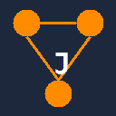
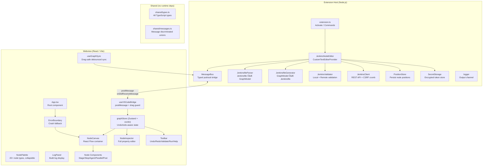
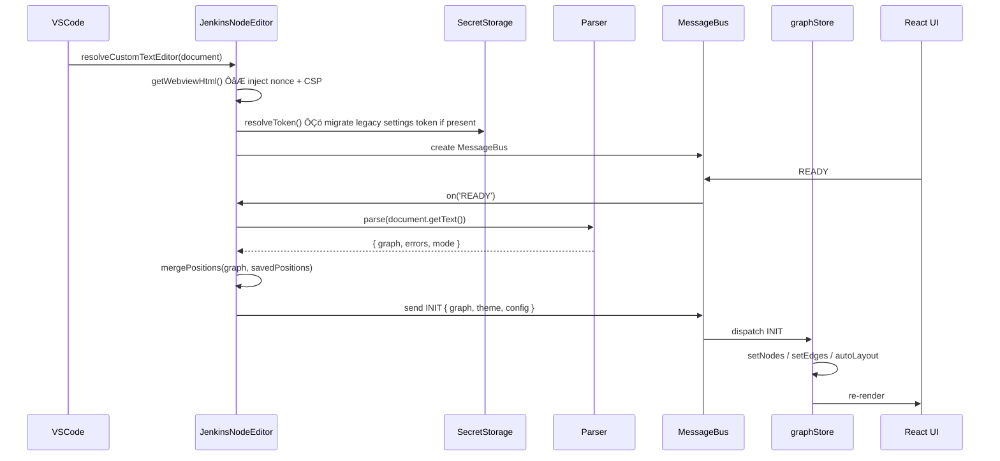
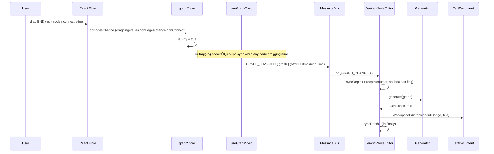
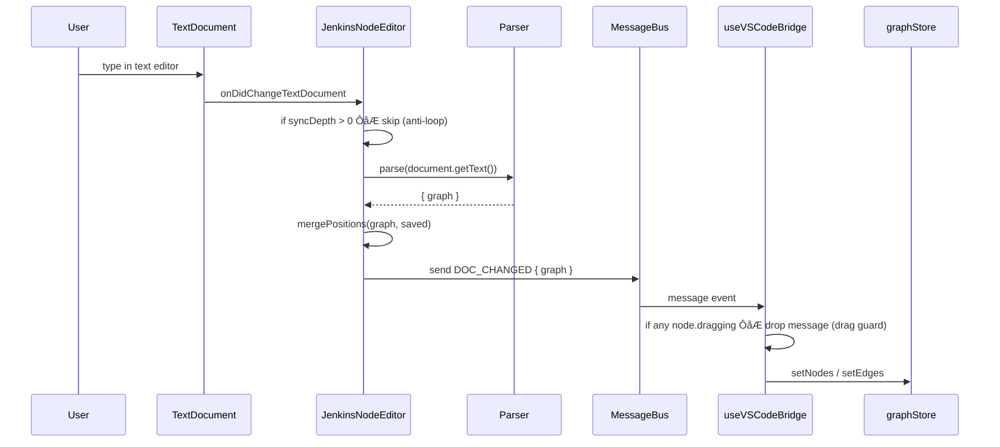
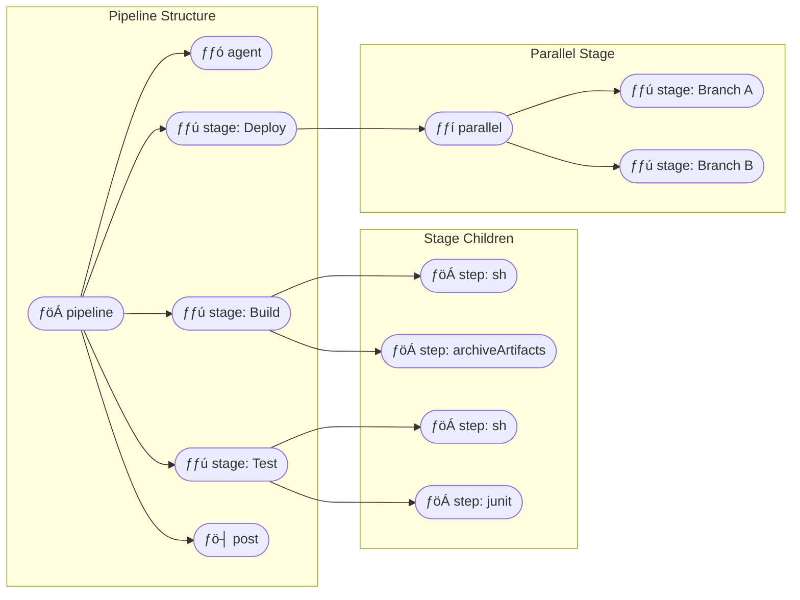

# Jenkins Node Editor

<div align="center">



> **A VS Code extension that turns any `Jenkinsfile` into an interactive visual node graph ÔÇö edit it, run builds, and stream logs, all without leaving your editor.**


</div>

---

## Table of Contents

- [Overview](#overview)
- [Features](#features)
- [Architecture](#architecture)
- [Data Flow](#data-flow)
- [Node Types](#node-types)
- [Message Protocol](#message-protocol)
- [Project Structure](#project-structure)
- [Installation](#installation)
- [Configuration](#configuration)
- [Usage](#usage)
- [Security](#security)
- [Development](#development)
- [Testing](#testing)
- [Tech Stack](#tech-stack)
- [Contributing](#contributing)
- [License](#license)

---

## Overview

Jenkins Node Editor renders a `Jenkinsfile` as a **live, editable node graph** powered by [React Flow](https://reactflow.dev/). Changes made in the graph are immediately reflected in the source file, and changes made in the text editor instantly update the graph ÔÇö a true **bidirectional sync**.

The UI is styled after **Blue Ocean**, Jenkins' own modern pipeline visualization UI.

```
┌─────────────────────────────────────────────────────────────────┐
│                        VS Code Window                           │
│                                                                 │
│  ┌─────────────────────────┐   ┌───────────────────────────┐   │
│  │   Text Editor (classic) │═──║  Jenkins Node Editor       │   │
│  │                         │   │  (Custom Editor Webview)   │   │
│  │  pipeline {             │   │                            │   │
│  │    agent any            │   │  ┌─────┐  ┌───────┐       │   │
│  │    stages {             │   │  │Agent│─║│ Build │       │   │
│  │      stage('Build') {   │   │  └─────┘  └───Ôö¼───┘       │   │
│  │        ...              │   │               │            │   │
│  │      }                  │   │           ┌───╝───┐        │   │
│  │    }                    │   │           │ Test  │        │   │
│  │  }                      │   │           └───Ôö¼───┘        │   │
│  │                         │   │               │            │   │
│  └─────────────────────────┘   │           ┌───╝───┐        │   │
│                                │           │Deploy │        │   │
│                                └───────────┤───────┤────────┘   │
└─────────────────────────────────────────────────────────────────┘
```

---

## Features

| Feature | Description |
|---------|-------------|
| **Visual Graph Editor** | Drag, drop, and connect pipeline nodes on a Blue Ocean–styled canvas |
| **Bidirectional Sync** | Edit text → graph updates; edit graph → text updates |
| **Surgical Sync** | Graph→file writes are minimal-diff: only the changed region is rewritten; everything else is preserved byte-for-byte |
| **Destructive-edit Guard** | If a write would delete >50% of a large file (a lossy regeneration), it is refused with a warning instead of corrupting the file |
| **Drag-safe Sync** | Sync is deliberately skipped while a node is being dragged — no mid-drag remounts |
| **Undo / Redo** | Full undo/redo history for node and edge changes via `zundo` (Ôå® / Ôå¬ in toolbar) |
| **Auto-layout** | Dagre-powered automatic node positioning on open |
| **Declarative Parser** | Full support for `pipeline {}`, `stages` (incl. nested), `agent`, `when` (incl. `anyOf`/`allOf`/`not`), `environment`, `parameters`, `triggers`, `post` |
| **Scripted Parser** | `node {}` scripted pipelines — stages and their steps, incl. stages nested in wrappers (`if`, `timestamps`, …) |
| **Node Palette** | 20+ node types in collapsible groups ÔÇö drag onto canvas to add |
| **Rich Node Inspector** | Full property editor for every node type: env vars, parameters, options, triggers, `when` conditions, post conditions, all step types |
| **Validation** | Local syntax check + optional remote Jenkins API validation, with inline node error markers (errors are mapped to their stage by name/line) |
| **Guided Setup** | If “Run Build” fails because Jenkins isn't configured, a **configuration panel opens automatically** so you can fill in URL / user / job / branch / token in place — no need to hunt through `settings.json` |
| **Build Parameters** | The `parameters {}` block of the Jenkinsfile is parsed and rendered as a form (text / `booleanParam` / `choice`); values are sent with **Run Build**, so you can set `FORCE_BUILD`, `BUILD_WORKERS`, etc. |
| **Raw Construct Support** | Constructs the visual model can't decompose — `script { … }`, multi-line `sh '''…'''` heredocs, `checkout([…])`, `withCredentials([…])` — become real nodes holding their **exact source text**, editable in the inspector and re-emitted verbatim (no reformatting). |
| **Lossless Surroundings** | Top-level Groovy helpers/constants around `pipeline { }` are preserved verbatim, so a regeneration never deletes them. |
| **Test Connection** | A one-click probe checks **server reachable → authenticated → job found** (per-step ✓/✕ report) before you trigger a build; works on unsaved panel values. |
| **CSRF-safe Builds** | Fetches a Jenkins CSRF crumb before every POST; crumb is cached and invalidated on 403 |
| **Secure Token Storage** | Jenkins API token stored in VS Code's encrypted **SecretStorage**, never in `settings.json` |
| **Build Trigger** | Trigger Jenkins builds directly from the editor |
| **Log Streaming** | Real-time build log streaming via Jenkins' progressive text API |
| **Theme Support** | Follows VS Code light / dark / high-contrast themes |
| **Position Memory** | Node positions persisted in `.vscode/` between sessions |
| **Error Boundary** | React ErrorBoundary wraps the root — crashes show a readable error panel, not a blank screen |

> **Fidelity caveat.** The graph models the common declarative shapes (stages,
> agent, steps, when, environment, parameters, triggers, post). Constructs it does
> not model — arbitrary `script { }` bodies, multi-line `sh '''…'''`, inline
> comments, some `checkout([...])` forms — are **preserved in the file** (surgical
> sync never touches them) but do not appear as nodes. When you edit a graph node,
> only that node's region is rewritten; the rest of the file, including unmodelled
> constructs, is left untouched. If a change would require rewriting most of the
> file, the write is refused rather than risking data loss.

---

## Architecture

The extension is split into two isolated runtimes that communicate via a typed message bus.


```mermaid
graph TB
    subgraph "Extension Host (Node.js)"
        EXT["extension.ts\nActivate / Commands"]
        EDITOR["JenkinsNodeEditor\nCustomTextEditorProvider"]
        BUS["MessageBus\nTyped pub/sub bridge"]
        PARSER["JenkinsfileParser\nJenkinsfile  GraphModel"]
        GEN["JenkinsfileGenerator\nGraphModel  Jenkinsfile"]
        VALIDATOR["JenkinsValidator\nLocal + Remote validation"]
        CLIENT["JenkinsClient\nREST API + CSRF crumb"]
        POSSTORE["PositionStore\nPersist node positions"]
        SECRETS["SecretStorage\nEncrypted token store"]
        LOGGER["logger\nOutput channel"]
    end

    subgraph "Webview (React / Vite)"
        APP["App.tsx\nRoot component"]
        BOUNDARY["ErrorBoundary\nCrash fallback"]
        CANVAS["NodeCanvas\nReact Flow container"]
        PALETTE["NodePalette\n20+ node types, collapsible"]
        INSPECTOR["NodeInspector\nFull property editor"]
        TOOLBAR["Toolbar\nUndo/Redo/Validate/Run/Help"]
        LOGPANEL["LogPanel\nBuild log display"]
        STORE["graphStore (Zustand + zundo)\nUndo/redo-aware state"]
        BRIDGE["useVSCodeBridge\npostMessage + drag guard"]
        SYNC["useGraphSync\nDrag-safe debounced sync"]
        NODES["Node Components\nStage/Step/Agent/Parallel/Post"]
    end

    subgraph "Shared (no runtime deps)"
        TYPES["shared/types.ts\nAll TypeScript types"]
        MESSAGES["shared/messages.ts\nMessage discriminated unions"]
    end

    EXT --> EDITOR
    EDITOR --> BUS
    EDITOR --> PARSER
    EDITOR --> GEN
    EDITOR --> VALIDATOR
    EDITOR --> CLIENT
    EDITOR --> POSSTORE
    EDITOR --> SECRETS
    BUS <-->|"postMessage\nonDidReceiveMessage"| BRIDGE
    BRIDGE --> STORE
    STORE --> CANVAS
    STORE --> INSPECTOR
    STORE --> TOOLBAR
    SYNC --> BUS
    CANVAS --> NODES
    APP --> BOUNDARY
    BOUNDARY --> CANVAS
```

---

## Data Flow

### Opening a Jenkinsfile


```mermaid
sequenceDiagram
    participant VSCode
    participant JNE as JenkinsNodeEditor
    participant Secrets as SecretStorage
    participant Parser
    participant Bus as MessageBus
    participant Store as graphStore
    participant UI as React UI

    VSCode->>JNE: resolveCustomTextEditor(document)
    JNE->>JNE: getWebviewHtml()  inject nonce + CSP
    JNE->>Secrets: resolveToken() ÔÇö migrate legacy settings token if present
    JNE->>Bus: create MessageBus
    UI->>Bus: READY
    Bus->>JNE: on('READY')
    JNE->>Parser: parse(document.getText())
    Parser-->>JNE: { graph, errors, mode }
    JNE->>JNE: mergePositions(graph, savedPositions)
    JNE->>Bus: send INIT { graph, theme, config }
    Bus->>Store: dispatch INIT
    Store->>Store: setNodes / setEdges / autoLayout
    Store->>UI: re-render
```

### Editing the Graph  File Sync


```mermaid
sequenceDiagram
    participant User
    participant RF as React Flow
    participant Store as graphStore
    participant Sync as useGraphSync
    participant Bus as MessageBus
    participant JNE as JenkinsNodeEditor
    participant Gen as Generator
    participant Doc as TextDocument

    User->>RF: drag END / edit node / connect edge
    RF->>Store: onNodesChange (dragging=false) / onEdgesChange / onConnect
    Store->>Store: isDirty = true
    Note over Sync: isDragging check ÔÇö skips sync while any node.dragging=true
    Sync->>Bus: GRAPH_CHANGED { graph } (after 300ms debounce)
    Bus->>JNE: on('GRAPH_CHANGED')
    JNE->>JNE: syncDepth++ (depth counter, not boolean flag)
    JNE->>Gen: generate(graph)
    Gen-->>JNE: Jenkinsfile text
    JNE->>Doc: WorkspaceEdit.replace(fullRange, text)
    JNE->>JNE: syncDepth-- (in finally)
```

### Text Edit  Graph Sync


```mermaid
sequenceDiagram
    participant User
    participant Doc as TextDocument
    participant JNE as JenkinsNodeEditor
    participant Parser
    participant Bus as MessageBus
    participant Bridge as useVSCodeBridge
    participant Store as graphStore

    User->>Doc: type in text editor
    Doc->>JNE: onDidChangeTextDocument
    JNE->>JNE: if syncDepth > 0  skip (anti-loop)
    JNE->>Parser: parse(document.getText())
    Parser-->>JNE: { graph }
    JNE->>JNE: mergePositions(graph, saved)
    JNE->>Bus: send DOC_CHANGED { graph }
    Bus->>Bridge: message event
    Bridge->>Bridge: if any node.dragging  drop message (drag guard)
    Bridge->>Store: setNodes / setEdges
```

---

## Node Types

The graph model uses 5 rendered node kinds and a rich property inspector for each:


```mermaid
graph LR
    subgraph "Pipeline Structure"
        P([­ƒöÁ pipeline]) --> A([­ƒƒó agent])
        P --> S1([­ƒƒú stage: Build])
        P --> S2([­ƒƒú stage: Test])
        P --> S3([­ƒƒú stage: Deploy])
        P --> POST([­ƒö┤ post])
    end

    subgraph "Stage Children"
        S1 --> ST1([­ƒöÁ step: sh])
        S1 --> ST2([­ƒöÁ step: archiveArtifacts])
        S2 --> ST3([­ƒöÁ step: sh])
        S2 --> ST4([­ƒöÁ step: junit])
    end

    subgraph "Parallel Stage"
        S3 --> PAR([­ƒƒí parallel])
        PAR --> B1([­ƒƒú stage: Branch A])
        PAR --> B2([­ƒƒú stage: Branch B])
    end
```

| Kind | Color | Description | Inspector sections |
|------|-------|-------------|-------------------|
| `pipeline` | ­ƒöÁ Blue | Root container node | Global agent, environment vars, parameters, options, triggers |
| `agent` | ­ƒ®Á Cyan | Execution agent | Type (any/none/label/docker/dockerfile) + type-specific fields |
| `stage` | ­ƒƒú Purple | Named pipeline stage | Name, agent override, `when` condition, `failFast`, env vars |
| `step` | ­ƒöÁ Teal | Individual build step | Type selector + all step-specific fields (sh/echo/git/checkout/archiveArtifacts/junit/timeout/retry/script/withCredentials/input/custom) |
| `parallel` | ­ƒƒí Amber | Parallel execution group | `failFast` toggle |
| `post` | ­ƒö┤ Red | Post-build condition | Condition (always/success/failure/unstable/changed/fixed/regression/aborted/cleanup) |

### Supported Step Types

| Step | Generated Groovy |
|------|-----------------|
| `sh` | `sh 'command'` |
| `bat` | `bat 'command'` |
| `echo` | `echo 'message'` |
| `git` | `git url: '', branch: ''` |
| `checkout` | `checkout scm` |
| `archiveArtifacts` | `archiveArtifacts artifacts: '**/*.jar'` |
| `junit` | `junit '**/surefire-reports/*.xml'` |
| `withCredentials` | `withCredentials([usernamePassword()]) {  }` |
| `timeout` | `timeout(time: 10, unit: 'MINUTES') {  }` |
| `retry` | `retry(3) {  }` |
| `input` | `input message: '', ok: ''` |
| `sleep` | `sleep time: 5, unit: 'SECONDS'` |
| `stash` / `unstash` | `stash name: '' ` / `unstash ''` |
| `slackSend` | `slackSend channel: '', message: ''` |
| `script` | Raw Groovy block |
| `custom` | Any other step ÔÇö raw Groovy preserved |

---

## Message Protocol

Communication between the Extension Host and the Webview uses strongly-typed discriminated unions defined in `src/shared/messages.ts`.

### Extension  Webview

| Message Type | Payload |
|---|---|
| `INIT` | `{ graph: GraphModel, theme: VSCodeTheme, config: ExtensionConfig }` |
| `DOC_CHANGED` | `{ graph: GraphModel }` |
| `VALIDATION_RESULT` | `{ errors: ValidationError[] }` |
| `STEP_CATALOG` | `{ steps: StepDefinition[] }` |
| `LOG_LINE` | `{ line: string, stream: 'stdout' \| 'stderr' }` |
| `BUILD_STATUS` | `{ status: BuildStatus }` |
| `THEME_CHANGED` | `{ theme: VSCodeTheme }` |

### Webview  Extension

| Message Type | Payload |
|---|---|
| `READY` | _(none)_ ÔÇö webview mounted |
| `GRAPH_CHANGED` | `{ graph: GraphModel }` |
| `VALIDATE_REQUEST` | `{ content?: string }` |
| `RUN_BUILD` | `{ jobName?: string, branch?: string, params?: Record<string,string> }` |
| `ABORT_BUILD` | `{ jobName?: string, buildNumber?: number }` |
| `ERROR` | `{ message: string, stack?: string }` |

---

## Project Structure

```
NodeCi/
├── ­ƒôä package.json                  # Extension manifest + scripts
├── ­ƒôä tsconfig.json                 # Extension host TypeScript config
├── ­ƒôä tsconfig.webview.json         # Webview TypeScript config
├── ­ƒôä vite.config.ts                # Webview build (Vite)
├── ­ƒôä esbuild.config.js             # Extension build (esbuild)
├── ­ƒôä vitest.config.ts              # Unit test config
│
├── ­ƒôü media/
│   └── icon.png                    # Extension icon
│
├── ­ƒôü src/
│   ├── ­ƒôü extension/               # Extension host (Node.js runtime)
│   │   ├── extension.ts            # Activate / deactivate + commands (incl. setToken)
│   │   ├── JenkinsNodeEditor.ts    # CustomTextEditorProvider ÔÇö SecretStorage, syncDepth
│   │   ├── MessageBus.ts           # Typed pub/sub bridge
│   │   ├── JenkinsValidator.ts     # Local + REST validation
│   │   ├── JenkinsClient.ts        # Jenkins REST API + CSRF crumb cache
│   │   ├── PositionStore.ts        # Persistent node positions
│   │   └── logger.ts               # VS Code output channel
│   │
│   ├── ­ƒôü parser/                  # Jenkinsfile Ôåö GraphModel
│   │   ├── JenkinsfileParser.ts    # Jenkinsfile ÔåÆ GraphModel
│   │   ├── JenkinsfileGenerator.ts # GraphModel ÔåÆ Jenkinsfile
│   │   └── layout.ts               # Dagre layout (extension-side)
│   │
│   ├── ­ƒôü shared/                  # Zero-dependency shared types
│   │   ├── types.ts               # All domain types
│   │   └── messages.ts            # Message protocol discriminated unions
│   │
│   └── ­ƒôü webview/                 # React UI (browser runtime)
│       ├── main.tsx               # React entry point + ErrorBoundary
│       ├── App.tsx                # Root layout component
│       ├── ­ƒôü components/
│       │   ├── NodeCanvas.tsx     # React Flow canvas + drag/drop + welcome state
│       │   ├── NodePalette.tsx    # 20+ draggable node types in collapsible groups
│       │   ├── NodeInspector.tsx  # Full property editor (env vars, when, params, optionsÔǪ)
│       │   ├── Toolbar.tsx        # Undo/Redo + Validate/Run/Abort + Help panel
│       │   └── LogPanel.tsx       # Streaming build log display
│       ├── ­ƒôü nodes/
│       │   ├── BaseNode.tsx       # Blue Ocean card chrome (glow on select, status dot)
│       │   ├── StageNode.tsx      # Stage node ÔÇö when badge, failFast indicator
│       │   ├── StepNode.tsx       # Step node ÔÇö type label + script preview
│       │   ├── AgentNode.tsx      # Agent node ÔÇö type + detail
│       │   ├── ParallelNode.tsx   # Parallel node ÔÇö branch count
│       │   ├── PostNode.tsx       # Post node ÔÇö condition badge
│       │   └── index.ts           # Module-level nodeTypes map (avoids remount bug)
│       ├── ­ƒôü hooks/
│       │   ├── useVSCodeBridge.ts # postMessage bridge + drag guard on DOC_CHANGED
│       │   ├── useGraphSync.ts    # Drag-safe debounced sync (skips while dragging)
│       │   └── useJenkinsAPI.ts   # Validate / run / abort hooks
│       ├── ­ƒôü store/
│       │   └── graphStore.ts      # Zustand + immer + zundo (undo/redo, 50-state limit)
│       ├── ­ƒôü utils/
│       │   ├── layout.ts          # Dagre auto-layout (webview-side)
│       │   └── theme.ts           # VS Code theme ÔåÆ CSS vars
│       └── ­ƒôü styles/
│           └── globals.css        # Blue Ocean CSS variables + utility classes
│
├── ­ƒôü test/
│   ├── runTests.js                # E2E test runner
│   ├── ­ƒôü fixtures/
│   │   ├── simple.Jenkinsfile     # 3-stage declarative pipeline
│   │   ├── parallel.Jenkinsfile   # Parallel stages example
│   │   └── complex.Jenkinsfile    # Full-featured pipeline
│   └── ­ƒôü suite/
│       └── parser.test.ts        # 19 Vitest unit tests
│
├── ­ƒôü docs/
│   ├── PHASE1.md ÔÇö PHASE6.md     # Phase-by-phase build notes
│
└── ­ƒôü dist/                        # Build output (git-ignored)
    ├── extension.js               # Bundled extension host
    └── ­ƒôü webview/
        ├── main.js               # Bundled React app
        └── main.css              # Bundled styles
```

---

## Installation

### From VS Code Marketplace

Search for **"Jenkins Node Editor"** in the Extensions panel (`Ctrl+Shift+X`), or install by ID:

```
PlanesZwalker.vscode-jenkins-node-editor
```

### From Source

**Prerequisites:** Node.js  20, npm  10, VS Code  1.85

```bash
git clone https://github.com/PlanesZwalker/vscode-jenkins-node-editor.git
cd vscode-jenkins-node-editor
npm install
npm run build
# Launch Extension Development Host:
# press F5 in VS Code, or install the .vsix:
npm run package
code --install-extension vscode-jenkins-node-editor-0.7.0.vsix
```

---

## Configuration

Open VS Code Settings (`Ctrl+,`) and search for **Jenkins Node Editor**:

| Setting | Type | Default | Description |
|---------|------|---------|-------------|
| `jenkinsNodeEditor.jenkinsUrl` | string | `""` | Jenkins server URL, e.g. `http://localhost:8080` |
| `jenkinsNodeEditor.jenkinsUser` | string | `""` | Jenkins username for API auth |
| `jenkinsNodeEditor.jenkinsJobName` | string | `""` | Jenkins job path for **Run Build**, e.g. `my-folder/my-job`. Required to trigger a build. |
| `jenkinsNodeEditor.jenkinsBranch` | string | `""` | Optional branch for multibranch jobs (e.g. `dev`). Appended to the job path (`glsl` + `dev` → `glsl/job/dev`). Leave empty if the job path already contains the branch. |
| `jenkinsNodeEditor.autoLayout` | boolean | `true` | Auto-layout the graph when opening a file. When `false`, only nodes **without** a saved position are laid out — your manual placements are always kept. |
| `jenkinsNodeEditor.syncDelay` | number | `300` | Debounce delay (ms) before syncing graph → text. |

> ÔÜá´©Å `jenkinsNodeEditor.jenkinsToken` has been **deprecated**. Use the secure command below instead.

### Setting the Jenkins API Token (secure)

> **Easiest path:** click **⚙ Settings** in the toolbar (or just hit **Run Build** —
> the panel opens by itself if something is missing) and fill in the four fields.
> The token is written to VS Code's **encrypted SecretStorage**, never to `settings.json`.

The token can also be set from the command palette:

The token is stored in VS Code's **encrypted SecretStorage**, not in `settings.json`:

```
Ctrl+Shift+P  Jenkins: Set Jenkins API Token (Secure)
```

On first launch, any token already in `settings.json` is **automatically migrated** to SecretStorage and removed from the file.

### Example `settings.json`

```json
{
  "jenkinsNodeEditor.jenkinsUrl": "http://jenkins.example.com:8080",
  "jenkinsNodeEditor.jenkinsUser": "alice",
  "jenkinsNodeEditor.autoLayout": true,
  "jenkinsNodeEditor.syncDelay": 300
}
```

---

## Usage

### Opening the Node Editor

1. Open any file named `Jenkinsfile`, `*.jenkinsfile`, `*.Jenkinsfile`, or `Jenkinsfile.*`
2. Click the **Jenkins Node Editor** icon in the editor title bar, **or** right-click the file in the Explorer  _Open Jenkins Node Editor_
3. The graph panel opens beside the text editor

### Editing Nodes

| Action | How |
|--------|-----|
| **Select node** | Click any node |
| **Move node** | Drag the node |
| **Edit properties** | Select node  Inspector panel (right) |
| **Add node** | Drag from the Node Palette (left) |
| **Delete node** | Select + `Delete` key |
| **Connect nodes** | Drag from a node's output handle (ÔùÅ) to another's input |
| **Undo / Redo** | `Ôå® Undo` / `Ôå¬ Redo` buttons in Toolbar (or use the toolbar buttons) |
| **Auto-layout** | `Ôè× Layout` button in Toolbar |
| **Fit view** | `Ôèí Fit` button in Toolbar |
| **Zoom** | Scroll wheel / pinch |
| **Pan** | Middle-click drag |
| **Keyboard help** | `? Help` button in Toolbar |

### Toolbar at a glance

```
[ ⊠ Layout ]  [ ↓ Fit ]  |  [ ↩ Undo ]  [ ↪ Redo ]  |  [ ✓ Validate ]  ▶ Run Build  |  [ ◐ Logs ]  [ ? Help ]
```

### Build Logs

When a build is running, the **Log Panel** shows at the bottom and streams log lines in real-time. The build status indicator in the Toolbar pulses blue while running, turns green on success, red on failure.

---

## Security

| Concern | Implementation |
|---------|----------------|
| **API token** | Stored in VS Code `SecretStorage` (OS-level encrypted), never in `settings.json` or committed to source control |
| **Token migration** | Existing `settings.json` tokens are auto-migrated to SecretStorage on first open, then removed from the file |
| **CSRF protection** | `JenkinsClient` fetches `/crumbIssuer/api/json` before every POST; crumb cached per client instance, invalidated on HTTP 403 |
| **Content Security Policy** | Webview uses a strict CSP with a per-session nonce ÔÇö no `unsafe-eval`, no plain `unsafe-inline` for scripts |
| **No external network** | The webview has no internet access; all Jenkins calls go through the extension host |

---

## Development

### Build Scripts

```bash
npm run build         # Build everything (extension + webview)
npm run build:ext     # Build only the extension host (esbuild)
npm run build:web     # Build only the webview (Vite)
npm run watch         # Watch mode for both (use with F5)
npm run test:unit     # Vitest unit tests
npm run package       # Bundle as .vsix
npm run publish       # Publish to Marketplace (requires vsce login)
```

### Debugging with F5

1. Open the workspace in VS Code
2. Press `F5`  launches **Extension Development Host**
3. In the new window, open a `Jenkinsfile`
4. Set breakpoints in `src/extension/` for extension host code
5. For webview debugging: open _Developer Tools_ (`Ctrl+Shift+I`) and inspect the `<iframe>`

### Adding a New Node Type

1. Add the new `NodeKind` literal to `src/shared/types.ts`
2. Create `src/webview/nodes/MyNewNode.tsx` extending `BaseNode`
3. Register it in `src/webview/nodes/index.ts` (module-level constant ÔÇö **not** inside a component)
4. Add a palette entry in `src/webview/components/NodePalette.tsx`
5. Add an inspector section in `NodeInspector.tsx`
6. Handle the kind in `JenkinsfileParser.ts` and `JenkinsfileGenerator.ts`

### Known Gotchas

- **`nodeTypes` must be a module-level constant** — declaring it inside a component causes React Flow to remount all nodes on every render
- **Sync is gated on drag end** — `onNodesChange` marks dirty only when `change.dragging === false`; `useGraphSync` skips while any node has `dragging: true`; `useVSCodeBridge` drops `DOC_CHANGED` messages during active drags
- **`useTemporalStore` is a React hook** — `useGraphStore.temporal` (from `zundo`) is a plain `StoreApi`, not callable. It is wrapped with `useStore()` so components can reactively subscribe to `pastStates`/`futureStates`. Calling it directly as a function throws `TypeError: Xi is not a function`
- **`detectMode()` must not be anchored to the file start** — real Jenkinsfiles often begin with comments, `@Library` annotations, or top-level Groovy constants (`IMAGE_MAP = [...]`) *before* `pipeline {`. The old `/^\s*pipeline\s*\{/` mis-classified those as `scripted`, so the graph rendered empty with no error. Detection now tokenizes (comment/string aware) and looks for a top-level `pipeline` block, with a line-anchored regex fallback.
- **`buildStageNodes()` must recurse into nested `stages { }`** — Jenkins allows `stage('X') { stages { stage(...) } }` (sequential stages / matrix parents). Without recursion, only top-level stages were emitted (a 21-stage Jenkinsfile showed just 2).
- **`extractLastKeyword()` must match args greedily** — stage names containing parentheses (`stage('Free RAM (staging)')`) broke the old non-greedy `[^)]*` matcher, leaving the whole expression as the keyword and silently dropping the stage.
- **dagre must receive `contains` edges** — skipping parent→child (`contains`) edges in the auto-layout left every step/agent/post unconnected, so dagre dumped them all into rank 0 (y≈0) and the graph rendered as a cramped row at the top.
- **Never regenerate the whole file** — the graph is lossy, so a full regeneration destroys unmodelled constructs. `applyGraphToDocument` computes a minimal-diff edit (`surgicalEdit.ts`) and refuses edits that would delete >50% of a large file.
- **The generator must be faithful** — it emits no blank lines, keeps `post` in source order, and never invents optional args (`fingerprint`). Any cosmetic divergence turns a no-op into a full-file diff.
- **Match the document's EOL before diffing** — the generator emits LF; a CRLF Jenkinsfile diffed against LF reads as "every line changed". `normalizeEol()` runs before `computeMinimalEdit`.
---

## Testing

### Unit Tests (Vitest)

```bash
npm run test:unit
```

53 tests covering the parser, generator, and sync engine:

```
✓ test/suite/parser.test.ts (19 tests)
✓ test/suite/real-world.test.ts (9 tests)
✓ test/suite/surgical-edit.test.ts (14 tests)
✓ test/suite/scripted-when-mapping.test.ts (11 tests)
✓ test/suite/build-params.test.ts (6 tests)
✓ test/suite/connection-test.test.ts (5 tests)
✓ test/suite/layout-options.test.ts (5 tests)
✓ test/suite/raw-steps.test.ts (8 tests)
✓ test/suite/real-constructs.test.ts (1 test)

  JenkinsfileParser — simple.Jenkinsfile
    ✓ parses without fatal errors
    ✓ detects declarative mode
    ✓ extracts 3 stage nodes (Build, Test, Deploy)
    ✓ stage names match Jenkinsfile
    ✓ extracts agent node (type: any)
    ✓ extracts post nodes
    ✓ all nodes have valid positions after layout
    ✓ edges connect stages in sequence

  JenkinsfileParser — parallel.Jenkinsfile
    ✓ parses without fatal errors
    ✓ detects parallel node
    ✓ parallel branches are present

  JenkinsfileParser — error cases
    ✓ empty string → error
    ✓ unbalanced braces → error
    ✓ partial input → partial graph

  JenkinsfileGenerator
    ✓ output contains 'pipeline' and 'stages'
    ✓ output ends with '}'
    ✓ indentation is divisible by 2
    ✓ round-trip preserves stage count
    ✓ generates agent block correctly

✓ test/suite/real-world.test.ts (9 tests)

  detectMode — leading content
    ✓ declarative preceded by comments + top-level constants
    ✓ declarative preceded by @Library
    ✓ plain declarative
    ✓ scripted still detected

  JenkinsfileParser — leading constants + nested stages
    ✓ detects declarative despite leading constants
    ✓ extracts ALL stages, including nested ones
    ✓ preserves stage names containing parentheses
    ✓ emits an edge for every node (graph is connected, not empty)
    ✓ auto-layout is hierarchical (contains edges keep steps under stages)

Test Files  2 passed (2)
     Tests  28 passed (28)
  Duration  ~550ms
```

### E2E Tests (real VS Code)

```bash
npm run test:e2e   # downloads VS Code, launches it, runs test/suite/**/*.e2e.js
```

```
✓ extension is present
✓ extension activates
✓ registers the custom editor and commands
✓ contributes the Jenkinsfile custom editor
```

The harness is `test/suite/index.js` (mocha, `tdd` UI) driven by
`test/runTests.js` (`@vscode/test-electron`). Unit tests are `*.test.ts` (Vitest,
plain Node); E2E tests are `*.e2e.js` (need a real VS Code host) — the two globs
never overlap.

### Test Fixtures

| Fixture | Description |
|---------|-------------|
| `simple.Jenkinsfile` | 3 stages (Build/Test/Deploy), `agent any`, post block |
| `parallel.Jenkinsfile` | Parallel stages, `failFast` |
| `complex.Jenkinsfile` | Environment vars, parameters, triggers, `when` conditions, Docker agent |
| `leading-constants-nested.Jenkinsfile` | Regression: top-level Groovy constants before `pipeline {`, nested `stages { }`, stage names containing parentheses |

---

## Tech Stack

| Layer | Technology | Version | Role |
|-------|-----------|---------|------|
| Extension host | TypeScript | 5.x | Type-safe extension code |
| Extension build | esbuild | 0.20 | Fast CJS bundle for Node.js |
| Webview UI | React | 18 | Component-based UI |
| Webview build | Vite | 5 | Fast ESM webview bundle |
| Node graph | `@xyflow/react` | 12 | Interactive canvas |
| State | Zustand + immer | 4.x | Immutable reactive store |
| Undo/redo | zundo | 2.x | Temporal middleware for Zustand |
| Layout | dagre | 0.8.5 | Directed-graph auto-layout |
| Unit tests | Vitest | 1.x | Fast test runner |
| E2E tests | `@vscode/test-electron` | 2.x | Real VS Code instance |

---

## Contributing

1. Fork and clone the repository
2. Create a feature branch: `git checkout -b feat/my-feature`
3. Install dependencies: `npm install`
4. Make your changes and add tests
5. Ensure all tests pass: `npm run test:unit`
6. Ensure the build is clean: `npm run build`
7. Open a Pull Request

---

## License

Apache 2.0 ┬® 2026 [PlanesZwalker](https://github.com/PlanesZwalker) ÔÇö see [LICENSE](LICENSE) for details.


<div align="center">


</div>
