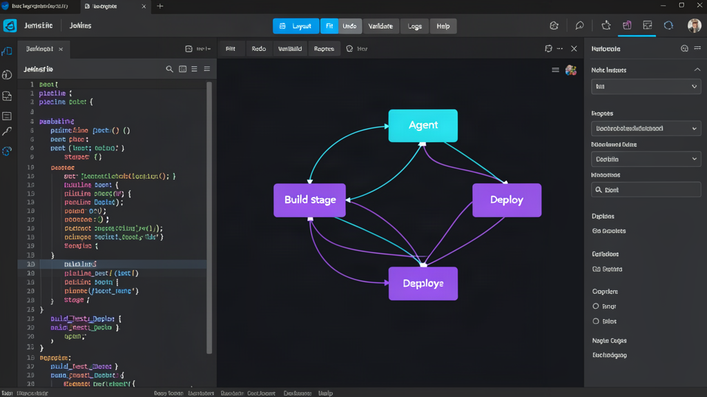
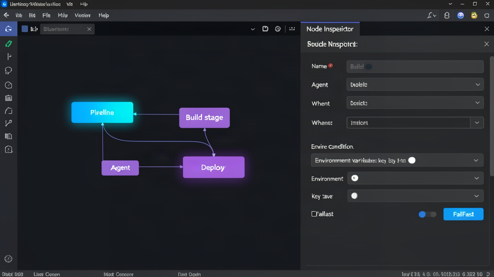
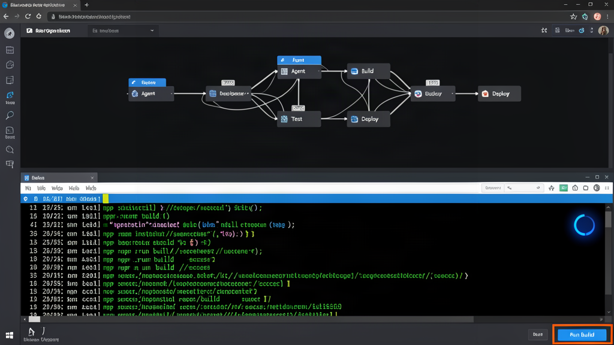

# Jenkins Node Editor

<div align="center">


> **Turn any `Jenkinsfile` into an interactive visual node graph — edit it, run builds, and stream logs, all without leaving VS Code.**


</div>

---

## Overview

Jenkins Node Editor renders a `Jenkinsfile` as a **live, editable node graph** powered by [React Flow](https://reactflow.dev/). Changes in the graph are immediately reflected in the source file, and changes in the text editor instantly update the graph — a true **bidirectional sync**.

The UI is styled after **Blue Ocean**, Jenkins' own modern pipeline visualization UI.

---

## Screenshots

### Main Editor View



*Visual node graph with Blue Ocean styling. Edit the graph and the Jenkinsfile updates in real-time.*

### Node Inspector



*Full property editor for every node type: environment variables, parameters, when conditions, and more.*

### Build Log Streaming



*Real-time build log streaming with status indicators. Trigger builds directly from the editor.*

---

## Features

| Feature | Description |
|---------|-------------|
| **Visual Graph Editor** | Drag, drop, and connect pipeline nodes on a Blue Ocean-styled canvas |
| **Bidirectional Sync** | Edit text → graph updates; edit graph → text updates |
| **Surgical Sync** | Graph→file writes are minimal-diff: only the changed region is rewritten |
| **Undo / Redo** | Full undo/redo history via `zundo` |
| **Auto-layout** | Dagre-powered automatic node positioning on open |
| **Declarative + Scripted Parser** | Full support for `pipeline {}` and `node {}` syntax |
| **Node Palette** | 20+ node types in collapsible groups |
| **Rich Node Inspector** | Full property editor for every node type |
| **Validation** | Local syntax check + optional remote Jenkins API validation |
| **Build Trigger** | Trigger Jenkins builds directly from the editor |
| **Log Streaming** | Real-time build log streaming via Jenkins' progressive text API |
| **Secure Token Storage** | Jenkins API token stored in VS Code's encrypted **SecretStorage** |
| **Theme Support** | Follows VS Code light / dark / high-contrast themes |

---

## Installation

### From VS Code Marketplace

Search for **"Jenkins Node Editor"** in the Extensions panel (`Ctrl+Shift+X`), or install by ID:

```
PlanesZwalker.vscode-jenkins-node-editor
```

### From Source

**Prerequisites:** Node.js ≥ 20, npm ≥ 10, VS Code ≥ 1.85

```bash
git clone https://github.com/PlanesZwalker/vscode-jenkins-node-editor.git
cd vscode-jenkins-node-editor
npm install
npm run build
# Press F5 in VS Code to launch Extension Development Host
```

---

## Usage

### Opening the Node Editor

1. Open any file named `Jenkinsfile`, `*.jenkinsfile`, `*.Jenkinsfile`, or `Jenkinsfile.*`
2. Click the **Jenkins Node Editor** icon in the editor title bar, **or** right-click the file in the Explorer → _Open Jenkins Node Editor_
3. The graph panel opens beside the text editor

### Editing Nodes

| Action | How |
|--------|-----|
| **Select node** | Click any node |
| **Move node** | Drag the node |
| **Edit properties** | Select node → Inspector panel (right) |
| **Add node** | Drag from the Node Palette (left) |
| **Delete node** | Select + `Delete` key |
| **Connect nodes** | Drag from a node's output handle to another's input |
| **Undo / Redo** | `↩ Undo` / `↪ Redo` buttons in Toolbar |
| **Auto-layout** | `⊠ Layout` button in Toolbar |
| **Fit view** | `↓ Fit` button in Toolbar |

### Toolbar

```
[ ⊠ Layout ]  [ ↓ Fit ]  |  [ ↩ Undo ]  [ ↪ Redo ]  |  [ ✓ Validate ]  ▶ Run Build  |  [ ◐ Logs ]  [ ? Help ]
```

---

## Configuration

Open VS Code Settings (`Ctrl+,`) and search for **Jenkins Node Editor**:

| Setting | Type | Default | Description |
|---------|------|---------|-------------|
| `jenkinsNodeEditor.jenkinsUrl` | string | `""` | Jenkins server URL |
| `jenkinsNodeEditor.jenkinsUser` | string | `""` | Jenkins username for API auth |
| `jenkinsNodeEditor.jenkinsJobName` | string | `""` | Jenkins job path for **Run Build** |
| `jenkinsNodeEditor.jenkinsBranch` | string | `""` | Optional branch for multibranch jobs |
| `jenkinsNodeEditor.autoLayout` | boolean | `true` | Auto-layout the graph when opening a file |
| `jenkinsNodeEditor.syncDelay` | number | `300` | Debounce delay (ms) before syncing graph → text |

### Setting the Jenkins API Token

The token is stored in VS Code's **encrypted SecretStorage**, never in `settings.json`:

```
Ctrl+Shift+P → Jenkins: Set Jenkins API Token (Secure)
```

---

## Security

| Concern | Implementation |
|---------|----------------|
| **API token** | Stored in VS Code `SecretStorage` (OS-level encrypted) |
| **CSRF protection** | Fetches a Jenkins CSRF crumb before every POST |
| **Content Security Policy** | Webview uses a strict CSP with a per-session nonce |
| **No external network** | The webview has no internet access; all Jenkins calls go through the extension host |

---

## Development

```bash
npm run build         # Build everything (extension + webview)
npm run build:ext     # Build only the extension host (esbuild)
npm run build:web     # Build only the webview (Vite)
npm run test:unit     # Vitest unit tests
npm run package       # Bundle as .vsix
```

### Debugging with F5

1. Open the workspace in VS Code
2. Press `F5` → launches **Extension Development Host**
3. In the new window, open a `Jenkinsfile`
4. Set breakpoints in `src/extension/` for extension host code
5. For webview debugging: open _Developer Tools_ (`Ctrl+Shift+I`) and inspect the `<iframe>`

---

## Testing

```bash
npm run test:unit     # Vitest unit tests
npm run test:e2e      # E2E tests (requires real VS Code)
```

---

## Tech Stack

| Layer | Technology |
|-------|-----------|
| Extension host | TypeScript 5.x |
| Extension build | esbuild 0.20 |
| Webview UI | React 18 |
| Webview build | Vite 5 |
| Node graph | `@xyflow/react` 12 |
| State | Zustand + immer 4.x |
| Undo/redo | zundo 2.x |
| Layout | dagre 0.8.5 |
| Unit tests | Vitest 1.x |
| E2E tests | `@vscode/test-electron` 2.x |

---

## Contributing

1. Fork and clone the repository
2. Create a feature branch: `git checkout -b feat/my-feature`
3. Install dependencies: `npm install`
4. Make your changes and add tests
5. Ensure all tests pass: `npm run test:unit`
6. Ensure the build is clean: `npm run build`
7. Open a Pull Request

---

## License

Apache 2.0 © 2026 [PlanesZwalker](https://github.com/PlanesZwalker) — see [LICENSE](LICENSE) for details.

<div align="center">


</div>
